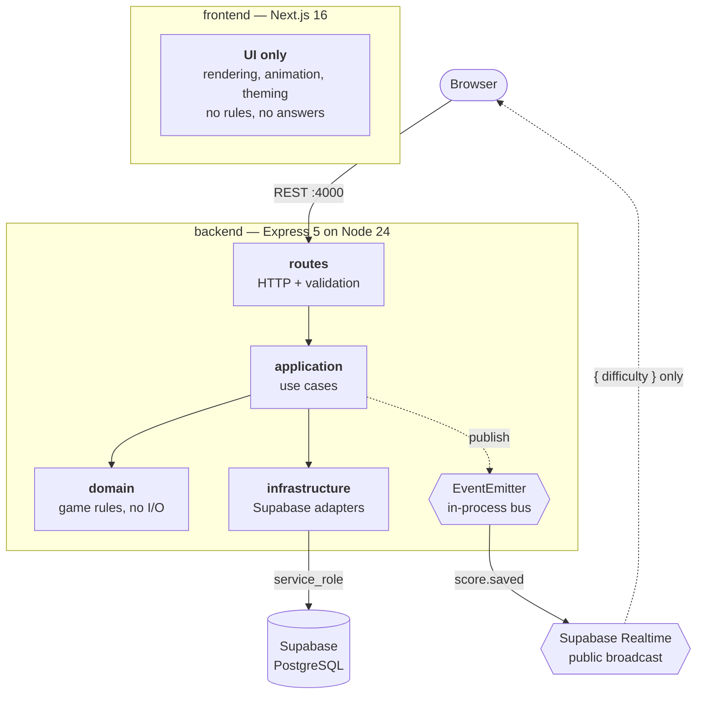
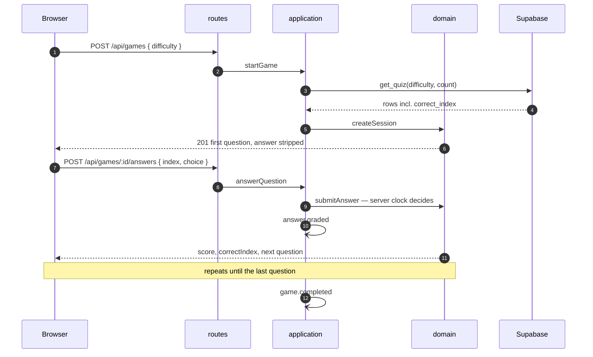
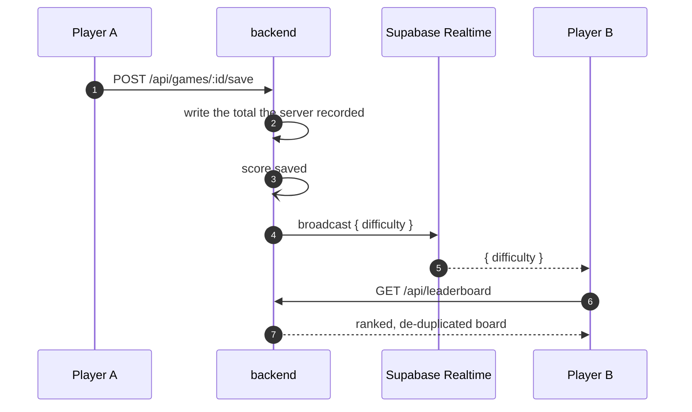

# Verse - A Catholic Bible Quiz Game

A responsive Catholic Bible quiz where every rule, answer and score lives on the server and
the browser is only ever a renderer. Scripture is quoted from the Catholic Public Domain
Version (CPDV) — public domain, and the full 73-book canon.

**Live at [verse.vercel.app](https://verse.vercel.app)** — the UI is hosted on Vercel, and
the API runs as a single always-on process on a container host, because in-flight rounds are
held in memory.

---

## Table of contents

- [The problem](#the-problem)
- [Architecture](#architecture)
- [Domain events](#domain-events)
- [Game flows](#game-flows)
- [Tech stack](#tech-stack)
- [Getting started](#getting-started)
- [Configuration](#configuration)
- [API reference](#api-reference)
- [Verification](#verification)
- [Implementation notes](#implementation-notes)
- [Project structure](#project-structure)
- [Known limitations](#known-limitations)
- [License](#license)

---

## The problem

A timed quiz has an awkward property: the thing the player must not know is the thing the
screen has to render. Ship the question bank to the browser and the game is over before it
starts — `correct_index` is one devtools panel away. Grade answers client-side and the
score is whatever the client says it is.

The usual shortcut is to obfuscate: hash the answer, strip it late, trust a token. All of
it is theatre, because the data still reaches the machine the player controls.

This implementation removes the question instead. **The browser never receives an answer,
never holds a timer that counts for anything, and never reports a score.** A question
leaves the API stripped of `correct_index` and `reference`; the deadline is enforced
against the server clock; and saving a score writes the total the *server* recorded for
that game id, ignoring the request body entirely.

The second tension is the leaderboard. It should update the moment someone else finishes,
which normally means giving the browser a database subscription — and with it, read access
to rows the backend is supposed to own. Here the browser subscribes to a **broadcast that
carries no data at all**, only the word `easy`, `medium` or `hard`. It is a nudge to go ask
the API again. The backend stays the only thing that can read a table.

---

## Architecture



Dependencies point inward. `domain` imports nothing from the other layers, so the rules
are pure and testable without a database. The dotted line back to the browser carries no
player data — it exists purely to say *something changed, ask again*.

---

## Domain events

`domain/events.ts` is a typed wrapper over Node's `EventEmitter`: in-process, no broker.
A queue would be the wrong tool here — the quiz is synchronous and single-player, and a
Kafka or RabbitMQ hop would add operational weight to solve a problem the app does not
have.

| Event | Published when | Consumed by |
|---|---|---|
| `answer.graded` | An answer is accepted, right or wrong | — |
| `game.completed` | The last question of a round is answered | activity log |
| `score.saved` | A finished round reaches the leaderboard | activity log, realtime broadcast |

The **application** layer publishes, not the domain. Nothing in `domain/game.ts` knows the
bus exists, which is what keeps its fifteen tests free of stubs.

A subscriber that throws is caught and logged, so a broken listener can never fail the
request that triggered it. Subscribers live in `application/subscribers.ts` and register
once at startup.

---

## Game flows

### A round



The `index` in the answer body is not decoration. The server rejects any answer whose
index does not match the question it is actually holding, which closes both replay and
skip-ahead in one check.

### A score reaching other players



Player B's browser learns only that *an easy round was saved*. Everything it renders comes
from an authenticated call to the API.

---

## Tech stack

| Layer | Choice | Notes |
|---|---|---|
| UI | Next.js 16 (App Router) | React 19, Turbopack |
| Styling | Tailwind CSS v4 | No config file — `@theme inline` and `@utility` in `globals.css` |
| Animation | Framer Motion | Respects `prefers-reduced-motion` app-wide via `MotionConfig` |
| Client state | Zustand | Three stores: auth, game, leaderboard |
| Theming | next-themes | Three-state System / Light / Dark, available on every screen |
| API | Express 5 on Node 24 | TypeScript executed directly — no build step |
| Persistence | Supabase (PostgreSQL) | `service_role` key, server-side only, behind RLS |
| Realtime | `@supabase/realtime-js` | Subscription only. The full client is never loaded |
| Tests | `node:test` | Built in; no framework dependency |

---

## Getting started

### Prerequisites

- Node.js 24+ (the backend relies on native TypeScript execution)
- A Supabase project

### 1. Apply the database schema

Run these in the Supabase SQL editor, in order, on a **new** project:

| File | Purpose |
|---|---|
| `backend/sql/schema.sql` | Tables, RLS policies, the new-user trigger, `get_quiz` |
| `backend/sql/seed.sql` | 75 CPDV questions across three difficulties |
| `backend/sql/leaderboard.sql` | Best-score-per-player ranking, unique display-name index |
| `backend/sql/lockdown.sql` | Revokes browser-level access to questions |

`schema.sql` runs once. On a database that already has the tables it fails with
`relation "users" already exists` — that is the script doing its job, not a bug. Later
schema changes ship as their own `alter` statements.

`backend/sql/reset-test-data.sql` is kept separately: it lists every registered player,
then deletes them and their scores. Irreversible, so it opens with a `select` you are
meant to read first.

### 2. Create the environment files

Two files, one per app — see [Configuration](#configuration). Both are gitignored.

### 3. Run both services

In two terminals:

```bash
cd backend && npm install && npm run dev
```

```bash
cd frontend && npm install && npm run dev
```

The API listens on `http://localhost:4000`, the UI on `http://localhost:3000`.

---

## Configuration

### `backend/.env` — never reaches the browser

```ini
PORT=4000
CORS_ORIGIN=http://localhost:3000

SUPABASE_URL=
SUPABASE_SERVICE_ROLE_KEY=
```

### `frontend/.env` — public by design, all of it ships to the browser

```ini
NEXT_PUBLIC_API_URL=http://localhost:4000

NEXT_PUBLIC_SUPABASE_URL=
NEXT_PUBLIC_SUPABASE_ANON_KEY=
```

| Key | Purpose |
|---|---|
| `SUPABASE_SERVICE_ROLE_KEY` | Full database access. Server-side only, never sent to a client |
| `NEXT_PUBLIC_SUPABASE_ANON_KEY` | Realtime subscription only. Public on purpose |
| `CORS_ORIGIN` | The single origin allowed to call the API |

The anon key being public is not an oversight. `lockdown.sql` revokes its access to
`questions` and `get_quiz`, and the leaderboard's readable-by-everyone policy is
deliberate. **Leave both Supabase values blank and the app still runs** — the leaderboard
simply refreshes on load instead of live.

---

## API reference

Only the backend talks to the database. Every route below is the browser's sole source of
game state.

| Method | Path | Purpose |
|---|---|---|
| `GET` | `/health` | Liveness probe |
| `POST` | `/api/auth/signup` | Creates an account and returns a session |
| `POST` | `/api/auth/signin` | Exchanges email and password for a session |
| `POST` | `/api/auth/refresh` | Trades a refresh token for a fresh session |
| `GET` | `/api/auth/me` | The signed-in player |
| `GET` | `/api/difficulties` | Question counts and timers, so the UI hard-codes no rules |
| `POST` | `/api/games` | Starts a round, returns the first question without its answer |
| `POST` | `/api/games/:gameId/answers` | Grades one answer, returns the score and the next question |
| `POST` | `/api/games/:gameId/save` | Writes the finished round to the leaderboard |
| `GET` | `/api/leaderboard` | Best score per player for one difficulty, plus the caller's own standing |

### `POST /api/games`

```json
{ "difficulty": "easy" }
```

Responds `201` with the first question — and note what is *absent*:

```json
{
  "gameId": "b3f1...",
  "difficulty": "easy",
  "totalQuestions": 10,
  "secondsPerQuestion": 20,
  "revealMs": 1000,
  "index": 0,
  "deadline": 1774483200000,
  "question": {
    "id": "0a9c...",
    "type": "fill_in_the_blank",
    "prompt": "Which word completes the verse?",
    "verse_text": "The Lord directs me, and nothing will be ______ to me.",
    "translation": "CPDV",
    "options": ["wanting", "denied", "hidden", "lacking"]
  }
}
```

No `correct_index`. No `reference` — that would name the verse and give the answer away on
a guess-the-book question.

### `POST /api/games/:gameId/answers`

```json
{ "index": 0, "choice": 3 }
```

Rejects `409 out_of_sync` if `index` is not the question the server is holding, and
`409 already_finished` once the round is over.

### `POST /api/games/:gameId/save`

Requires `Authorization: Bearer <accessToken>`. The body is ignored — the server writes
the total it recorded. Returns `409 not_finished` for an unfinished round and
`409 already_saved` on a second attempt.

### `GET /api/leaderboard?difficulty=easy&limit=20`

One row per player — their best round at that difficulty — so replaying cannot crowd out
other players. A signed-in caller also receives their own standing even when it falls
outside the returned page.

---

## Verification

Sample output is taken from real runs; ids are shortened.

### The browser cannot see an answer

```bash
curl -s -X POST http://localhost:4000/api/games \
  -H "Content-Type: application/json" -d '{"difficulty":"easy"}'
```

```
keys: ['id', 'type', 'prompt', 'verse_text', 'translation', 'options']
leaksAnswer: False
```

### The server refuses what the client asserts

| Attempt | Result |
|---|---|
| `POST .../save` with `{"score": 999999}` | Body ignored; the server's own total is written |
| `POST .../save` on an unfinished round | `409 not_finished` |
| `POST .../save` twice | `409 already_saved` |
| `POST .../save` without a token | `401` |
| Re-answering a finished round | `409 already_finished` |
| Answering with a stale `index` | `409 out_of_sync` |

### Database lockdown

An anon-level read of `questions` returns `[]`, and `get_quiz` returns
`permission denied for function`. The same calls with the service role succeed. Bank
intact at easy 20 / medium 25 / hard 30.

### Domain events fire on real requests

```
game.completed 775b8dd5 easy 930 points 3/10 in 2s
```

### The realtime broadcast round-trips

```
status: SUBSCRIBED
broadcast sent
received: [{"difficulty":"medium"}]
ROUND TRIP OK
```

### Question bank

```bash
cd backend && npm run verify:questions
```

```
75 questions verified against the CPDV text.
```

### Tests and build

```bash
cd backend && npm test && npm run typecheck
```

```bash
cd frontend && npm run typecheck && npm run lint && npm run build
```

22 backend tests cover scoring, the timeout and latency-grace boundaries, replay and
skip-ahead rejection, the event bus including a throwing subscriber, and the guarantee
that a question leaves the server without its answer.

### On a phone

Measured in a real browser at 375 x 812:

| | |
|---|---|
| Initial JavaScript | 631 KB across 8 scripts |
| Leaderboard + realtime | 61 KB, fetched only when the board is opened |
| Game screen | No scroll; all four answers on screen |
| Pinch-zoom | Not blocked |

---

## Implementation notes

### The client holds nothing worth stealing

`toPublic()` in `domain/game.ts` is the single chokepoint that turns a stored question into
a sent one, and it names the six fields that may travel. Adding a field to the database
cannot leak it by accident — a new field has to be added to that function deliberately.

### The server clock is the only clock

The countdown bar in the UI is decoration. Grading compares `Date.now()` on the server
against the deadline it issued, plus a 1.5 s latency grace so a slow network does not cost
a player a correct answer. A client that fakes its own timer changes nothing.

### Index matching closes replay and skip-ahead together

An earlier version tracked only "has this game finished", which let a second POST silently
answer the *next* question. The client now sends the index it believes it is on and the
server rejects a mismatch. One comparison, two holes closed — and a test that failed
before the fix.

### Separate Supabase clients, on purpose

`infrastructure/accounts.ts` builds its own client rather than sharing the one in
`supabase.ts`. `signInWithPassword` mutates the session on whichever client it is called
against; sharing would silently downgrade the service role used for every data read in the
process.

### The question bank is generated, not written

`backend/scripts/question-bank.ts` holds references, options and answers — never verse
text. `verify-questions.ts` pulls the wording from the CPDV dataset and generates
`sql/seed.sql`, so misquoting Scripture is structurally impossible rather than a matter of
proofreading.

The check asserts, for all 75 questions, that the verse matches the source word for word,
that a fill-in-the-blank restores to the original verse, that a guess-the-book answer
really is that book, that **no verse gives away its own answer**, and that `seed.sql` is
still in step with the bank. That last rule caught two live defects: Judges 6:12 names its
own speaker, and Joshua 24:15 is 322 characters and would have overflowed the mobile hero.

CPDV follows Vulgate psalm numbering, so the shepherd psalm is 22, not 23. References are
rendered `Psalm 22 (23):1` — correct for the text, findable by anyone who knows the common
numbering.

### Realtime as a doorbell, not a pipe

`frontend/src/lib/realtime.ts` exports `onScoreSaved` and deliberately **never exports the
client**. The browser cannot read a table even by accident, because it has no handle to
one. The payload is `{ difficulty }` and nothing else, since the channel is public.

The browser also loads `@supabase/realtime-js` rather than `@supabase/supabase-js`. The
full client bundles Postgres, auth, storage and edge-function modules the UI never touches;
dropping them cut the largest chunk from 400 KB to 220 KB. `LeaderboardScreen` is then
loaded on demand, so even that is paid only by players who open the board.

### Reduced motion is honoured once, centrally

`<MotionConfig reducedMotion="user">` in `providers.tsx` covers every Framer animation in
the app. The CSS `rise` utility has its own `prefers-reduced-motion` rule. Neither has to
be remembered per component.

---

## Project structure

```
frontend/                     Next.js UI. No database access, no game rules.
├── src/app/                  Routes, layout, providers, global styles
├── src/components/           Screens and inline SVG icons
├── src/lib/                  API client, realtime subscription
└── src/store/                Zustand stores: auth, game, leaderboard

backend/                      Express API. Rules, scoring, validation, persistence.
├── src/server.ts             Wiring: cors, json, routers, error handler
├── src/routes/               HTTP and request validation only
├── src/application/          Use cases; orchestrates domain + adapters
├── src/domain/               Game rules and the event bus. No I/O
├── src/infrastructure/       Supabase adapters
├── scripts/                  Question bank + the CPDV verifier
└── sql/                      Schema, seed, lockdown, leaderboard, reset

README.md                     This file
LICENSE                       MIT
```

### Scripts

| Command | Description |
|---|---|
| `npm run dev` | Run in watch mode (both apps) |
| `npm test` | Backend test suite (`node:test`) |
| `npm run typecheck` | `tsc --noEmit` (both apps) |
| `npm run lint` | ESLint (frontend) |
| `npm run build` | Production build (frontend) |
| `npm run verify:questions` | Check all 75 questions against the CPDV text |
| `npm run seed:write` | Regenerate `sql/seed.sql` from the question bank |

### Game rules

| Difficulty | Questions | Seconds per question |
|---|---|---|
| Easy | 10 | 20 |
| Medium | 15 | 15 |
| Hard | 20 | 15 |

Score is `100 per correct answer + 10 per second left on the clock`. Guests play without
an account; finishing a round offers sign-in, and the score saves as soon as the account
exists. Display names are unique, case-insensitively.

Supabase email confirmation is on by default, so a new account must confirm before signing
in. Turn it off under **Authentication -> Providers -> Email** if you would rather players
start immediately.

---

## Known limitations

These are deliberate, and documented rather than hidden.

**Game sessions live in memory.** `domain/game.ts` holds in-flight rounds in a `Map`, expired after
an hour and swept every ten minutes. A restart strands every round in progress, and running more than one API instance
would break unless requests are pinned to the instance that started the game. Moving the
session store behind an interface backed by Redis is the fix; it is not needed at one
instance.

**`answer.graded` has no subscriber.** It is published on every answer and nothing listens.
Kept as a deliberate extension point for streaks and analytics, but it is speculative, and
by a strict reading of YAGNI it should not exist yet.

**Realtime is fire-and-forget.** A browser that is offline when a broadcast goes out never
receives it and will show a stale board until something else triggers a refetch. There is
no replay. Acceptable for a leaderboard; anything that mattered would want Redis Streams
or a queue with acknowledgements.

**Speaker attribution is not machine-checked.** The verifier proves the verse text, the
blanked word and the book. Who *said* a line is an editorial judgement made by hand across
23 questions — the one part of the bank a script cannot defend.

**No frontend tests.** Typecheck, lint and build pass, and the flows have been exercised by
hand in a real browser, but there is no automated coverage of the UI.

**Schema changes are manual.** SQL is applied through the Supabase editor with no migration
tooling, so there is no ordering guarantee and no rollback.

**Free-tier Supabase projects pause after a week of inactivity** and must be resumed from
the dashboard.

---

## License

Released under the [MIT License](LICENSE). Copyright (c) 2026 Francis Remoshan.

---

<p align="center"><sub>Built so that the only thing the browser can cheat at is reading the verse.</sub></p>
